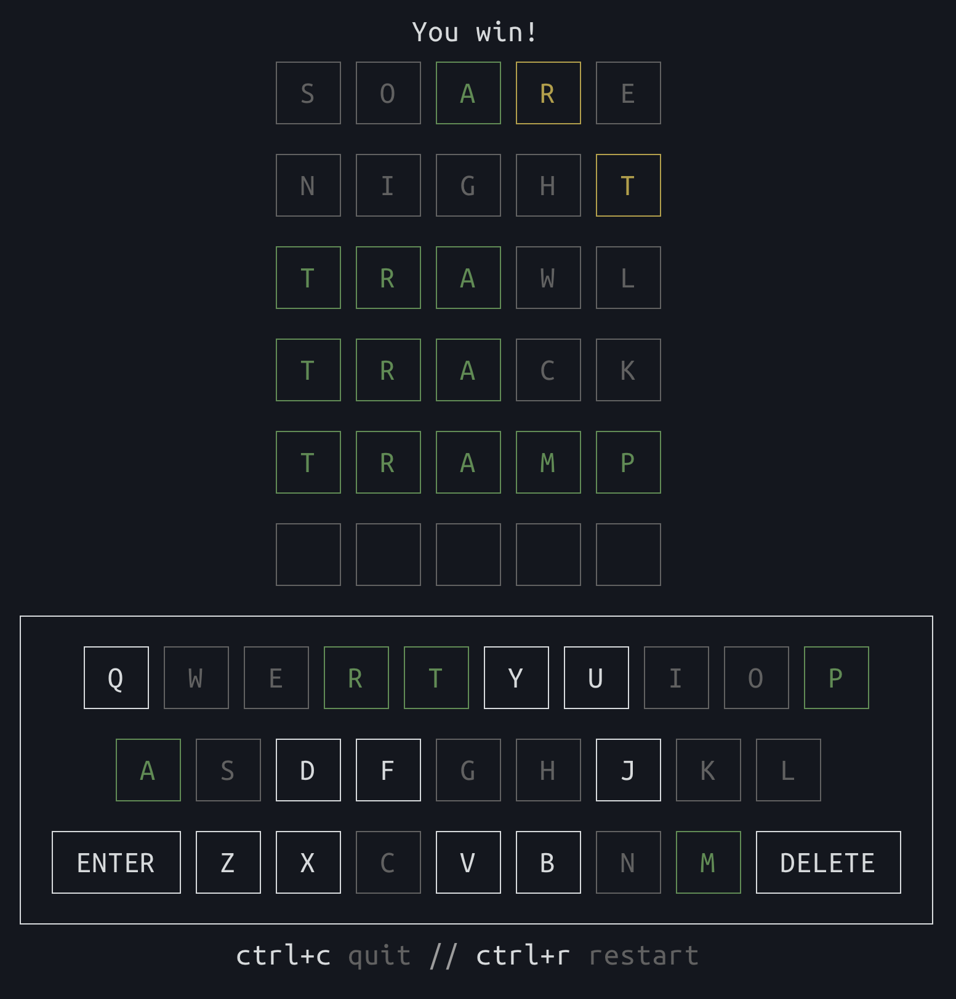

> [!NOTE]
> **This is a test fixture, not the real project.**
> `dispatrick/clidle-test` is a clone of [`ajeetdsouza/clidle`](https://github.com/ajeetdsouza/clidle)
> used purely as a sandbox for testing [Dispatch](https://upsun.com). It exists so we
> have a small, real-feeling Go codebase to open throwaway pull requests against.
> It is not maintained, not deployed, and not affiliated with the upstream author.
> All credit for the actual game goes to the original project (MIT licensed — see `LICENSE`).

<div align="center">

# clidle

**Wordle, now over SSH.**



**Try it:**

```sh
ssh clidle.duckdns.org -p 3000
```

**Or, run it locally:**

```sh
go install github.com/ajeetdsouza/clidle@latest
```

</div>

## How to play

You have 6 attempts to guess the correct word. Each guess must be a valid 5 letter
word.

After submitting a guess, the letters will turn green, yellow, or gray.

- **Green:** The letter is correct, and is in the correct position.
- **Yellow:** The letter is present in the solution, but is in the wrong position.
- **Gray:** The letter is not present in the solution.

## Hard mode

Pass `-hard` to require that revealed hints are reused in every subsequent guess:

```sh
clidle -hard
```

- Letters revealed as **green** must stay in the same position.
- Letters revealed as **yellow** must appear somewhere in the guess.

Guesses that ignore a hint are rejected with a message explaining which hint was
missed. The server can also be started in hard mode with `clidle -serve ADDR -hard`.

## Scoring

Your final score is based on how many guesses it took to arrive at the solution:

| Guesses | Score |
| ------- | ----- |
| 1       | 100   |
| 2       | 90    |
| 3       | 80    |
| 4       | 70    |
| 5       | 60    |
| 6       | 50    |

Scores are halved in hard mode.
